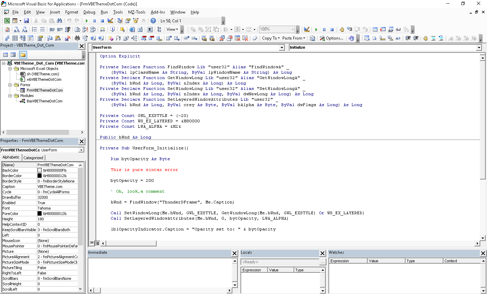

---
# Intro.

Hello, thanks for coming by. This is an adaption of the website I had for this project (https://www.vbetheme.com/).

Hopefully someone can look at this code and if you find it useful *make it better*.

It is meant to be an easy to use program to set the Visual Basic for Applications Editor theme (the one used by Microsoft Office® for VBA programming).

P.s. I recommend using GhostWriter to view these .md files. You may get it from https://wereturtle.github.io/ghostwriter/

---
# Welcome.

```
	Sub HolaMundo()
	   MsgBox "Hello World!", _
	   vbInformation, _
	   "My App"
	End Sub
```


Well, hello there. I am here to answer *what should be* a simple question: How do I change VBA Editor into dark mode?

The editor,also know as:
* VBA editor
* Visual Basic Editor
* Visual basic for applications Editor
* VBA code window

(...) and other variations

Is mostly know for attempting to deprive us from our eyesight, I mean, just look at it:



after a few hours of working with it your eyes usually start to swell...

Fellow programmers, my proposal is to make it, if not perfect, at least bearable. How? You ask. Well, I spent about 4 weeks reverse engineering the hell out of it and creating this document; then, I wrote a program that changes the theme to one of a... selected few (give me some credit, I only had 16 colors to work with).


---
# Themes.

## Themes offered:
#### 00 - Default (The one offered out of the box, by Microsoft®)
#### 01 - Dark
#### 02 - La vie en rose
#### 03 - vim Dark Blue
#### 04 - What is The Matrix?
#### 05 - White on blue


### Examples:

#### Dark


#### Desert


#### Nostalgie


#### vicsar


#### Rose


#### vim


#### Matrix


---
# Download.

The software is now moved to GitHub, not worth keeping it to myself, as there were lots of work and costs involved, including the website and maintaining it (that can get expensive) so here you go. I am very interested in helping you and others. Tell your friends about it! Post it in social media, have people download the software from the original source, all of that helps.

## Thanks.
As of October 31, 2021 the software had been downloaded by 586 unique individuals (in the course of 11 months). I like to thank you for any donations, so far I haven't received any, but they make a huge difference and are a great encouragement to developers that help you tackle your day-to-day challenges.

## How to donate.
Thanks for your interest in a donation, I am very grateful. Please use this link:

[https://www.paypal.com/donate?hosted_button_id=GD7GJH8ALP5W4](https://www.paypal.com/donate?hosted_button_id=GD7GJH8ALP5W4)


--- 
# How to use.

**Simple is beautiful!**

Here is a video on How to use the VBE Theme Switcher software

[https://www.youtube.com/watch?v=PsGB3Cnmx9k](https://www.youtube.com/watch?v=PsGB3Cnmx9k)

You can also see this video in the assets folder (how-to-use-final-cut.mp4)

Video Transcript:

>
> Using the software is simple:
>
> Step 0: Close Any Microsoft Office programs you might be running.
>
> Step 1: Open the VBE Theme Switcher software.
>
> Step 2: Select a theme.
>
> Step 3: Click "Apply Theme".
>


---
# Why?

Because there are so many forums in which people is asking for an easy way to accomplish this and no one has done anything about it... without attempting to hack the dlls or similar; needless to say, that is cumbersome, risky, and potentially destructive. Danger Will Robinson, Danger!

Furthermore, I was so tired of moving from one computer to the next to have to set it up over, and over, and over again that I decided to devote some time to finding a quicker solution. As far as I can remember, after testing, no admin rights where needed to run VBE Themes.exe (see the \bin\Debug\ folder).

---
# Let's talk.
If you need to reach me you may find a way at [https://www.vicsar.win/](https://www.vicsar.win/) or thru GitHub. Pull requests are welcomed. Please notice that each contribution should be clearly documented with, at a minimum, details on:

* What it is intended to do.
* How it is implemented.
* How it is used.

Thanks for your contribution.


---
# How it works.

This is a registry key (see \assets\original-regs\ and \assets\regs-themes\):
Stored under Computer\HKEY_CURRENT_USER\SOFTWARE\Microsoft\VBA\7.1\Common

"CodeForeColors"="0 0 5 0 1 10 14 0 0 0 0 0 0 0 0 0 "
"CodeBackColors"="0 0 0 7 6 0 0 0 0 0 0 0 0 0 0 0 "

Each one of these numbers above represent one of the 16 basic Windows-Colors.

We have: 

White 1
FFFFFF

Silver 2
C0C0C0

Gray 3
808080

Black 4
000000

Red 5
FF0000

Maroon 6
800000

Yellow 7
FFFF00

Olive 8
808000

Green 9
008000

Lime 10
00FF00

Aqua 11
00FFFF

Teal 12
008080

Blue 13
0000FF

Navy 14
000080

Fuchsia 15
FFFFFF

Purple 16
800080

Then we have 16 "columns" the first 10 represent an attribute:

01 Normal Text
02 Selection Text
03 Syntax Error
04 Execution Point Text
05 Breakpoint Text
06 Comment Text
07 Keyword Text
08 Identifier Text
09 Bookmark Text
10 Call Return Text

Now, you might be asking: What the other 6 are for? Right? Well, me too. This has taken me a lot more than expected for reverse engineer (I got bored many times) so, for now I am happy with covering the basics. If you figure it out let me know. Remember your contribution to the software is valuable.

IndicatorBar is the Reg Key for the Margin Indicator Bar, enabled by default

FontFace is the selected font, 10 by default

FontHeight is the selected font size, 10 by default

---
# To do.

Highly recommended settings (to implement):

NotifyUserBeforeStateLoss:
Enable it so that you receive a message notifying you that the action requested will cause the all module level variables to be reset for a running project.

RequireDeclaration:
Enable it so that explicit variable declarations are required in modules. Selecting this adds the Option Explicit statement to general declarations in any new module and save a lot of possible human errors.

BreakOnServerErrors:
Break on class module, extremely useful. Any unhandled error produced in a class module causes the project to enter break mode at the line of code in the class module which produced the error.


---
# Disclaimer:
## In a nutshell:
**Don't sue me.** Software is provided as is, you are responsible if it breaks something.

No warranty of any kind, neither express nor implied, is included with the software products in our website. It is safe software to the best of our knowledge, don't want to risk it? Don't download it. Either way I thank you for the visit.

THE SOFTWARE IS PROVIDED "AS IS", WITHOUT WARRANTY OF ANY KIND, EXPRESS OR IMPLIED, INCLUDING BUT NOT LIMITED TO THE WARRANTIES OF MERCHANTABILITY, FITNESS FOR A PARTICULAR PURPOSE AND NONINFRINGEMENT. IN NO EVENT SHALL THE AUTHORS OR COPYRIGHT HOLDERS BE LIABLE FOR ANY CLAIM, DAMAGES OR OTHER LIABILITY, WHETHER IN AN ACTION OF CONTRACT, TORT OR OTHERWISE, ARISING FROM, OUT OF OR IN CONNECTION WITH THE SOFTWARE OR THE USE OR OTHER DEALINGS IN THE SOFTWARE.

You may copy, distribute and modify the software as long as you track changes/dates in source files. Any modifications to or software including (via compiler) GPL-licensed code must also be made available under the GPL along with build & install instructions.

Read the license file (license.txt) for more information as to what your rights and duties are.

But:

## You Can
* Commercial Use
* Modify
* Distribute
* Place Warranty
* Use Patent Claims

## You Must
 * Include Original
 * State Changes
 * Disclose Source
 * Include License
 * Include Copyright
 * Include Install Instructions

## You Cannot
 * Sublicense
 * Hold Liable